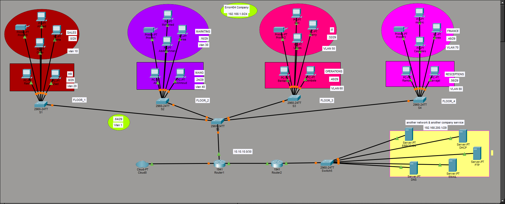

# 🏢 Error404 Company — Multi-VLAN Campus Network
### Cisco Packet Tracer Simulation


> A fully simulated **Multi-VLAN Enterprise Campus Network** for **Error404 Company**.  
> The network spans **4 floors**, serving **8 departments** with full VLAN segmentation,  
> inter-VLAN routing, a dedicated server farm, and external cloud connectivity.

---

##  Table of Contents

- [Overview](#-overview)
- [Network Topology](#-network-topology)
- [IP Addressing Scheme](#-ip-addressing-scheme)
- [Server Farm](#-server-farm)
- [Technologies Used](#-technologies-used)
- [Testing & Verification](#-testing--verification)
- [Learning Objectives](#-learning-objectives)
- [Author](#-author)

---

## 🌐 Overview

| Field | Details |
|-------|---------|
| **Company Name** | Error404 Company |
| **Network Address** | 192.168.1.0/24 |
| **Floors** | 4 Floors |
| **Departments** | 8 (Sales, HR, Marketing, Management, IT, Operations, Finance, Receptions) |
| **VLANs** | 8 VLANs (10, 20, 30, 40, 50, 60, 70, 80) |
| **Routers** | 2 × Cisco 1941 |
| **Switches** | 5 × Cisco 2960-24TT |
| **Servers** | DHCP, DNS, Email, FTP, ERROR404 |
| **External** | Cloud connectivity + Second company network (192.168.200.1/29) |

---

##  Network Topology



> *Full topology .*

---

##  IP Addressing Scheme

| Network Segment | Address | Subnet Mask | Notes |
|-----------------|---------|-------------|-------|
| VLAN 10 — Sales | 192.168.1.0/29 | 255.255.255.248 | Floor 1 |
| VLAN 20 — HR | 192.168.1.8/29 | 255.255.255.248 | Floor 1 |
| VLAN 30 — Marketing | 192.168.1.16/29 | 255.255.255.248 | Floor 2 |
| VLAN 40 — Management | 192.168.1.24/29 | 255.255.255.248 | Floor 2 |
| VLAN 50 — IT | 192.168.1.32/29 | 255.255.255.248 | Floor 3 |
| VLAN 60 — Operations | 192.168.1.40/29 | 255.255.255.248 | Floor 3 |
| VLAN 70 — Finance | 192.168.1.48/29 | 255.255.255.248 | Floor 4 |
| VLAN 80 — Receptions | 192.168.1.56/29 | 255.255.255.248 | Floor 4 |
| VLAN 1 — Core | 192.168.1.64/29 | 255.255.255.248 | Core Switch S5 |
| WAN Link | 10.10.10.0/30 | 255.255.255.252 | Router1 ↔ Router2 |
| Server Farm | 192.168.200.1/29 | 255.255.255.248 | External company network |

---

##  Server Farm

Located in the **external company network (192.168.200.1/29)**, reachable via Router2:

| Server | Service | Role |
|--------|---------|------|
| **ERROR404** | Company Server | Main application server |
| **DHCP** | DHCP Server | Dynamic IP assignment for all VLANs |
| **DNS** | DNS Server | Internal name resolution |
| **EMAIL** | Mail Server | Company-wide email service |
| **FTP** | FTP Server | File transfer and storage |

---

##  Technologies Used

| Technology | Implementation |
|------------|---------------|
| **VLANs** | 8 VLANs — one per department |
| **Subnetting** | /29 masks — efficient use of 192.168.1.0/24 |
| **Inter-VLAN Routing** | Via core switch and routers |
| **Static Routing** | Between Router1 ↔ Router2 |
| **DHCP** | Centralized DHCP server for all VLANs |
| **DNS** | Internal DNS server |
| **FTP / Email** | Dedicated servers for file and mail services |
| **Cloud Simulation** | Internet access via Cloud0 |
| **802.1Q Trunking** | All switch uplinks carry multiple VLANs |


---

##  Testing & Verification

```cisco
! Check all VLANs are active
Switch# show vlan brief

! Verify trunk links between switches
Switch# show interfaces trunk

! Test inter-VLAN routing — ping from Sales PC to IT PC
PC> ping 192.168.1.33

! Verify routing table on routers
Router# show ip route

! Check DHCP leases
Router# show ip dhcp binding
```

---

##  Learning Objectives

This project demonstrates proficiency in:

- [x] Multi-VLAN enterprise campus network design
- [x] VLAN creation and trunk configuration
- [x] Inter-VLAN routing
- [x] Efficient subnetting with /29 masks
- [x] Centralized DHCP, DNS, FTP, and Email servers
- [x] Static routing between routers
- [x] Cloud and external network simulation
- [x] Network documentation and IP planning

---

## 👤 Author

**Omar Awad**
- 🐙 GitHub: [OmarAwad911](https://github.com/OmarAwad911)
- 💼 LinkedIn: [omar-eldomyaty](https://www.linkedin.com/in/omar-eldomyaty/)
- 📧 Email: omareldomyaty70@gmail.com

---

> 💡 *Designed to simulate real enterprise networking scenarios using Cisco technologies.*  
> ⭐ *If this project helped you, consider giving it a star!*
